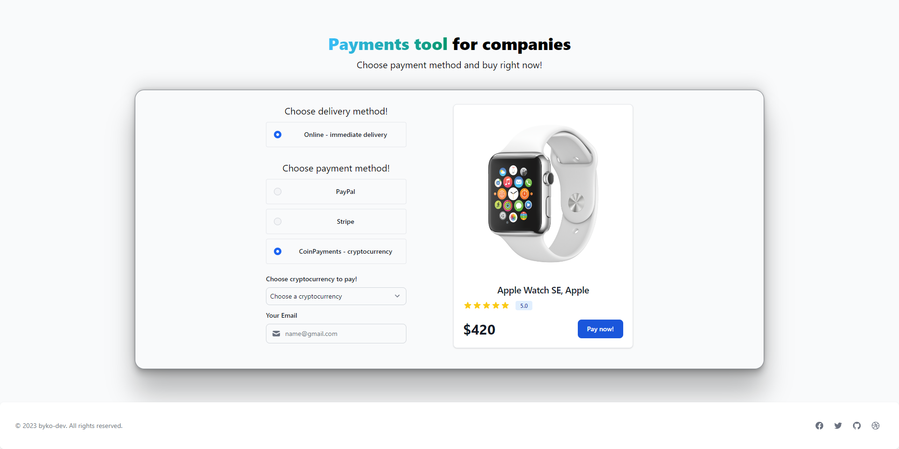
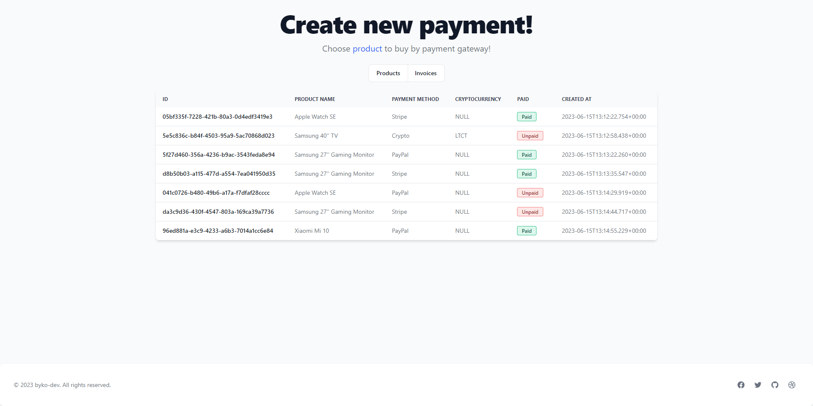
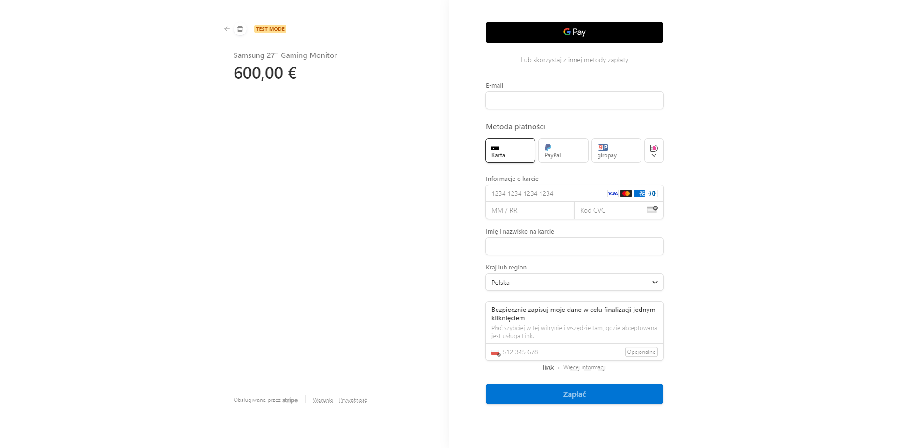
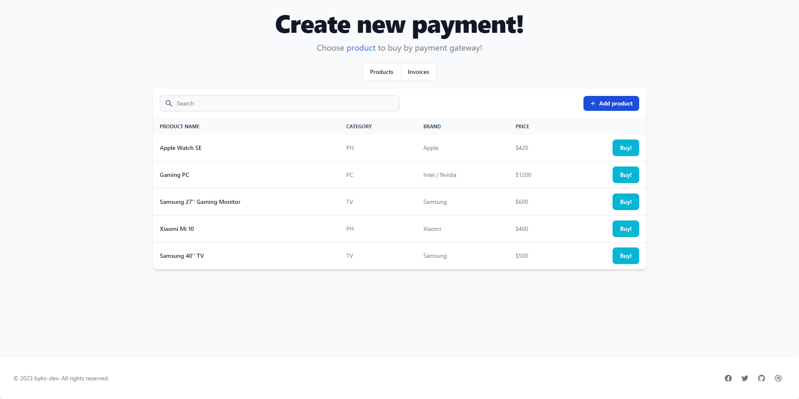

## Payment Gateway Integration for Stripe, PayPal and CoinPayments

This project is a comprehensive, payment gateway integration system that combines three popular payment processors: Stripe, PayPal, and CoinPayments. 
The system is built using, SpringBoot Framework for the backend and React with Redux for the frontend side

### Tech Stack

**Server:** Spring Boot, PostgreSQL, RestClient, HibernateJPA, SQL

**Client:** React, Redux, TailwindCSS, SCSS

### Frontend UI photos





### Key Features:

1. Stripe Integration: Seamlessly integrate Stripe to allow users to make payments by credit/debit cards, and other supported payment methods. The system ensures the highest level of data security through secure tokenization of sensitive payment information.
2. PayPal-Integration: Provide users with the option to make payments by using their PayPal accounts. The system securely handles all PayPal payment methods, including authentication and transaction management.
3. CoinPayments Integration: Support cryptocurrency payments through CoinPayments. Users can select from a variety of cryptocurrencies & complete transactions securely.
4. User-Friendly Interface: The frontend, developed using React.js and Redux, offers a responsive website look & intuitive user interface. Real-time updates and feedback on the payment provide a seamless payment experience.
5. Transaction-Management Module: Efficiently manage each transaction, including order processing with payment verification, & error handling. The system also ensures reliability and integrity throughout the payment process.
6. Customization & Scalability: The project's architecture is designed to be easily scalable and customizable. It allows for the future addition of new payment processors, providing flexibility to further expansion too.

### API References

#### Products Controller Requests

##### Create product 
```
  POST /product
```
| Parameter | Type     | Description                |
| :-------- | :------- | :------------------------- |
| `name`    | `string` | **Required**. Product name |
| `price`   | `float`  | **Required**. Product price |
| `brand`   | `string`  | **Required**. Product brand |
| `category`   | `string`  | **Required**. Category of product |

##### Get all products API

```
  GET /products
```

#### Invoice Controller Request

##### Get all-invoices/
```
  GET /invoices
```

#### CoinPayments Controller Requests

##### Create payment
```
  POST /crypto/create/payment
```
| Parameter | Type     | Description                |
| :-------- | :------- | :------------------------- |
| `productId`    | `string` | **Required**. Product id |
| `email`   | `string`  | **Required**. Buyer email |
| `cryptocurrency` | `string`  | **Required**. Code of cryptocurrency |

#### PayPal and Stripe Controller Requests 

##### Create payment
```
  POST API /{method}/create/payment
```
| Parameter | Type     | Description                |
| :-------- | :------- | :------------------------- |
| `method`    | `string` | **Required**. `paypal` or `stripe` |
| `productId`   | `string`  | **Required**. Product id |


